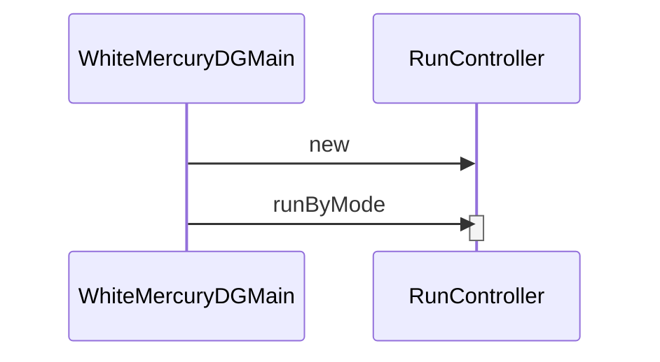

# White Mercury DG Primary Sequence Diagram for Target State

This document contains the sequence diagram that represents a data generation run in target state.  It does not represent the current state of the code.

