# White Mercury DG High Level Design for Target State

This document contains the high-level design for the target state of the White Mercury Data Generator.  It does not represent the current state of the code.  Current state will be documented in a separate document.

## High Level Design Goals (in priority order)

### Primary Goals

1. Behavior driven by configuration and not user interactions
2. Scale to large datasets easily balancing performance and cost
3. Handle generation of entities representing related data from multiple record sets
4. Entity structure defined by reusable schemas
5. Support three primary types of data stores: key-value, object stores, and SQL
6. Support generation of data locally as well as through connectors to online data stores

### Nice-To-Have Goals

* Automatically scaling mechanism
* Containerization
* Connector support for 3 major cloud providers: Azure, Google, and AWS
* Ability to scale a single job across multiple instances running in multiple containers
* Ability to generate entities for messaging infrastructure like Pulsar and Kafka to simulate loaded infrastructure
* Ability to generate entities for graph databases like Neo4j and CosmosDB to simulate loaded infrastructure

### Technical Issues

* How to handle auto-incrementing fields in data stores
* How to handle many-to-many relationships of records in an entity

## Design Principles

1. ***File-Driven Behavior***: All configuration is stored in a file format as job definitions, entity profiles, and schemas.  Destination connection information is stored as part of the job definition.
2. ***Single-Pass Definition***: For multi-record entities, the entity profile defines the relationship between the records and records are generated in order so that any foreign keys are available when a record is generated.  The order is defined in the entity profile and not assumed or automatically produced by the application.

## Primary Sequence Diagram

This sequence diagram represents a generic data generation run in target state.  It doesn't not show the level of details that would reveal all implementation details.  It is intended to show the high-level flow of the application.  Any interface definitions should be visible at this level of detail and are documented in the class diagram following the sequence diagram.

```mermaid
sequenceDiagram
    participant WhiteMercuryDGMain
    participant RunController
    participant GenerationJob
    participant EntityGenerator
    participant RecordGenerator
    participant FieldGenerator
    participant DataDestination
    WhiteMercuryDGMain->>RunController: runAllJobs()
    activate RunController
    RunController->>RunController: loadJobs()
    loop for each job
        RunController->>GenerationJob: runJob()
        activate GenerationJob
        GenerationJob->>GenerationJob: loadEntities()
        loop for each entity
            GenerationJob->>EntityGenerator: generateData(entityProfile)
            activate EntityGenerator
            EntityGenerator->>EntityGenerator: loadRecords()
            loop for each record
                EntityGenerator->>RecordGenerator: generateRecord()
                activate RecordGenerator
                RecordGenerator->>FieldGenerator: loadFields()
                loop for each field
                    RecordGenerator->>FieldGenerator: generateField()
                    activate FieldGenerator
                    FieldGenerator-->>RecordGenerator: return fieldValue
                    deactivate FieldGenerator
                end
                opt if related records need parent to be written first or data store is transactional
                    RecordGenerator->>DataDestination: writeRecord(recordData)
                end
                loop for each related record
                    RecordGenerator->>RecordGenerator: generateRecord(foriegnKeyField)
                    activate RecordGenerator
                    deactivate RecordGenerator
                    Note right of RecordGenerator: generateRecord() is a recursive call to<br/>another RecordGenerator instance<br/>and has the same behavior as<br/>the generateRecord() call above
                end
                opt if record with related records has not be written to destination
                    RecordGenerator->>DataDestination: writeRecord(entireRecordDataTree)
                end
                deactivate RecordGenerator
            end
            deactivate EntityGenerator
        end
        deactivate GenerationJob
    end
    RunController-->>WhiteMercuryDGMain: return output
    deactivate RunController
```

## High Level Class Diagram

This class diagram illustrates the primary classes and interfaces required in the flow of the application in target state.  It does not show all classes that implement the application.

## Roadmap to Target State

